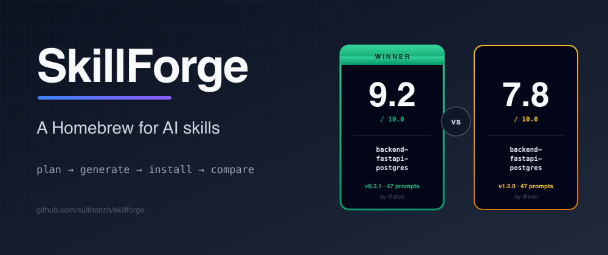

<p align="center">
  
</p>

<p align="center">
  <strong>AI-powered local skill builder for engineers.</strong><br>
  <sub>Local-first · 6 LLM providers · LLM-as-judge eval harness · marketplace bridge with scoped tokens</sub>
</p>

SkillForge helps engineers generate reusable, tool-specific skills from natural language. Instead of manually writing rigid skills from scratch, you describe what you need:

> I need a backend engineering skill for building production-ready FastAPI services with PostgreSQL, Docker, migrations, testing, and CI/CD.

SkillForge recommends the tools, generates an editable skill manifest, creates the skill files (`SKILL.md`, `README.md`, `config.yaml`), lets you customize everything, and installs the final skill locally into `~/.skillforge/skills`.

---

## Table of Contents

- [Problem statement](#problem-statement)
- [Why SkillForge exists](#why-skillforge-exists)
- [Features](#features)
- [Screenshots](#screenshots)
- [Quickstart](#quickstart)
- [Usage examples](#usage-examples)
- [AI provider configuration](#ai-provider-configuration)
- [Local install directory](#local-install-directory)
- [Skill manifest example](#skill-manifest-example)
- [CLI usage](#cli-usage)
- [Web UI usage](#web-ui-usage)
- [Development setup](#development-setup)
- [Testing](#testing)
- [Roadmap](#roadmap)
- [Contributing](#contributing)
- [License](#license)

---

## Problem statement

Engineering skills are usually too rigid and manually created for specific use cases. Engineers also frequently don't know the best tools, frameworks, architecture patterns, or workflow to use for a specific task. Forcing users to choose everything upfront produces generic "full-stack" skills that don't actually help.

## Why SkillForge exists

SkillForge flips that workflow. You describe an engineering need in plain English, an AI planner recommends a **specific, tool-driven** stack and explains each choice, and SkillForge generates a focused skill — never a generic one. Skills are generated, reviewed, customized, and installed locally. No cloud account, no telemetry, no auto-execution of generated scripts.

Skill names are intentionally specific:

```
backend-fastapi-postgres
data-airflow-dbt-bigquery
devops-kubernetes-helm-terraform
ai-rag-langchain-pgvector
observability-opentelemetry-grafana
web-scraping-python-playwright
```

## Features

- 🗣️ **Chat-based skill planning** — describe a need in natural language.
- 🧠 **AI tool recommendation** — specific tools, each with a reason.
- ✏️ **Editable manifest** — change tools, workflow, best practices before generating.
- 👁️ **File preview** — review `SKILL.md`, `README.md`, `config.yaml` before installing.
- 💾 **Local installation** — skills land in `~/.skillforge/skills/<skill-name>`.
- 📚 **Skill registry** — list, validate, and remove installed skills.
- 🖥️ **Local Web UI** — Next.js + TypeScript + Tailwind + shadcn/ui.
- 🚀 **One-command run** — `skillforge serve` serves the API **and** Web UI from a single port (no separate Node process).
- 📦 **Single binary** — package the whole app (API + Web UI) into one standalone executable with `./scripts/build-binary.sh`; no Python install needed on the target.
- ⚙️ **CLI** — `skillforge serve | plan | generate | install | list | validate | remove`.
- 🔌 **Provider-agnostic AI** — Mock, OpenAI-compatible (OpenAI/OpenRouter/Groq/Together/Mistral/DeepSeek/xAI/Z.ai…), Ollama, **Anthropic (Claude)**, **Google Gemini**, and **Cohere** — switchable live from Settings.
- 🧪 **Eval & benchmark harness** — run skills against test prompts, auto-score with an LLM-as-judge, and compare setups side-by-side to find the best SKILL config.
- 🌗 **Light / dark / system theme** — persisted, no-flash.
- 🛡️ **Safe by default** — never auto-runs scripts, never installs without confirmation, never overwrites without `--overwrite`.

## Screenshots

> _Screenshots placeholder_ — run `skillforge serve` and open `http://localhost:3000` to see the chat planner, tool recommendation cards, manifest editor, and file preview.

## Quickstart

### Prerequisites

- Python 3.10+
- Node.js 18+ (only needed to build/develop the Web UI)
- (Optional) Docker & Docker Compose

### Option A — One command, one port (recommended)

After a one-time install of the backend + CLI:

```bash
cd apps/api  && pip install -e ".[dev]"      # backend + dev deps
cd ../cli    && pip install -e .             # the `skillforge` command
skillforge serve --build-web                 # builds the Web UI, then serves everything
```

Open **<http://localhost:8000>** — the Web UI **and** the API are served from that single port. No second terminal, no CORS, no Node runtime left running. That's it.

Subsequent runs are just `skillforge serve` (the built Web UI is reused). Re-run with `--build-web` any time you pull changes that touch the UI.

> Heads-up: the one-command path needs Node installed once to build the Web UI. If you'd rather not install Node locally, use the Docker option below — the image builds the UI for you.

### Option B — Docker

Single container (API + Web UI on one port — closest to a single binary):

```bash
cp .env.example .env
docker compose --profile single up --build
# → http://localhost:8000
```

Two services (separate ports, useful when developing the UI in isolation):

```bash
docker compose up --build
# → API http://localhost:8000, Web UI http://localhost:3000
```

### Option C — Development with hot-reload

For hacking on the Web UI with Next.js fast-refresh:

```bash
skillforge serve --dev
# API on http://localhost:8000, Web UI (hot-reload) on http://localhost:3000
```

The dev server proxies `/api` and `/health` to the API, so just open :3000. Ctrl-C stops both.

### Option D — Single executable (no Python/Node install on the target)

SkillForge can be packaged into one standalone binary (PyInstaller) that bundles
the Python runtime, the API, the tool catalog, the Jinja2 templates, **and** the
pre-built Web UI. The resulting executable runs anywhere with no dependencies:

```bash
# Build it (needs Python + Node on the *build* machine):
pip install pyinstaller
./scripts/build-binary.sh

# Run it (needs nothing on the target machine):
./dist/skillforge                                  # serves http://localhost:8000
./dist/skillforge plan "backend skill for FastAPI and PostgreSQL"
./dist/skillforge --help
```

The binary is ~22 MB, one file. Running it with no arguments defaults to `serve`,
so double-clicking or `./skillforge` just opens the app. Use this when you want
to distribute SkillForge to a machine without Python.

> The binary is platform-specific (build on macOS for macOS, Linux for Linux, etc.) and is not committed to git — rebuild it per platform with `scripts/build-binary.sh`.

### Install just the pieces you need

```bash
cd apps/api  && pip install -e ".[dev]"   && uvicorn skillforge_api.main:app --reload   # API only
cd apps/cli  && pip install -e .          && skillforge --help                          # CLI
cd apps/web  && npm install && npm run dev                                              # Web UI dev
```

## Usage examples

Plan a backend skill from natural language:

```bash
skillforge plan "I need a backend skill for FastAPI, PostgreSQL, Docker, and Pytest"
```

Install a generated skill and list it:

```bash
skillforge install ./generated-skill
skillforge list
```

See [`examples/`](./examples) for ready-made skills:

- [`backend-fastapi-postgres`](./examples/backend-fastapi-postgres)
- [`data-airflow-dbt-bigquery`](./examples/data-airflow-dbt-bigquery)
- [`ai-rag-langchain-pgvector`](./examples/ai-rag-langchain-pgvector)

## AI provider configuration

SkillForge supports **six provider families**, all switchable live from the **Settings** page (config persisted to `~/.skillforge/config.json`) or via environment variables (see [`.env.example`](./.env.example)). Secrets are only ever read from the environment or the local config file.

| Provider | Env value | Notes |
|---|---|---|
| Mock | `mock` | Offline, deterministic. Default — zero config. |
| OpenAI-compatible | `openai-compatible` | OpenAI, OpenRouter, Groq, Together, Mistral, DeepSeek, xAI, Fireworks, Z.ai… (preset chips in Settings fill the base URL) |
| Ollama | `ollama-local` | Local LLMs, no API key |
| Anthropic | `anthropic` | Claude via the native Messages API |
| Google Gemini | `gemini` | Gemini via the Generative Language API |
| Cohere | `cohere` | Command R+ via the Cohere Chat API |

```bash
# OpenAI-compatible
export SKILLFORGE_AI_PROVIDER=openai-compatible
export SKILLFORGE_OPENAI_BASE_URL=https://api.openai.com/v1
export SKILLFORGE_OPENAI_API_KEY=sk-...
export SKILLFORGE_MODEL=gpt-4.1

# Anthropic (Claude)
export SKILLFORGE_AI_PROVIDER=anthropic
export SKILLFORGE_ANTHROPIC_API_KEY=sk-ant-...
export SKILLFORGE_MODEL=claude-3-5-sonnet-latest

# Google Gemini
export SKILLFORGE_AI_PROVIDER=gemini
export SKILLFORGE_GEMINI_API_KEY=AIza...
export SKILLFORGE_MODEL=gemini-2.0-flash

# Cohere
export SKILLFORGE_AI_PROVIDER=cohere
export SKILLFORGE_COHERE_API_KEY=...
export SKILLFORGE_MODEL=command-r-plus

# Ollama (local LLM, no API key)
export SKILLFORGE_AI_PROVIDER=ollama-local
export SKILLFORGE_OLLAMA_BASE_URL=http://localhost:11434
export SKILLFORGE_MODEL=llama3.1

# Mock (offline / tests / CI)
export SKILLFORGE_AI_PROVIDER=mock
```

The mock provider returns deterministic, well-formed manifests and is the default so the project runs with zero configuration. The Web UI's Settings page lets you pick any provider, enter the key/model, **Test connection**, and Save — no restart needed.

## Eval &amp; benchmark harness

Open **/eval** to test which SKILL setup is best:

- **Run** — pick a skill + a test suite (a default "General" suite ships pre-seeded; each skill also runs against its own example prompts). For each prompt, the harness runs the skill's `SKILL.md` as guidance, then asks the provider (LLM-as-judge) to score the response 0–10 against the skill's own output standards. Results stream into an expandable table with color-coded scores + reasoning.
- **Compare** — pick 2+ skills + a suite → summary (aggregate score + win-count) and per-prompt side-by-side cards with the winner highlighted. Manual override supported via the API.

Runs persist to SQLite so you can track scores across iterations. A cost guard caps completions per run (`SKILLFORGE_EVAL_MAX_CALLS=50`). Never executes generated scripts — eval only calls the chat API.

## Local install directory

Installed skills are written to:

```
~/.skillforge/skills/<skill-name>/
  SKILL.md
  README.md
  config.yaml
  prompts/
  templates/
  scripts/
  examples/
```

Override the directory with `SKILLFORGE_SKILLS_DIR`.

## Skill manifest example

`config.yaml` for every generated skill:

```yaml
schema_version: "1.0"
skill:
  name: backend-fastapi-postgres
  title: Backend FastAPI PostgreSQL Skill
  domain: Backend Engineering
  description: Helps engineers build production-ready FastAPI services with PostgreSQL.
  version: "0.1.0"
  status: draft
ai:
  generated_by: skillforge
  planner_model: configured-model-name
  created_at: 2026-06-17T00:00:00Z
tools:
  - name: Python
    category: language
    enabled: true
    reason: Primary language for this backend skill.
  # ... more tools
architecture:
  patterns: [Clean Architecture, Domain-Driven Design, Test-Driven Development]
workflow:
  - Clarify API requirements
  - Design domain models
  # ...
outputs:
  required_files: [SKILL.md, README.md, config.yaml]
  required_directories: [prompts, templates, scripts, examples]
safety:
  auto_execute_scripts: false
  require_user_confirmation_before_install: true
  allow_network_access: false
```

See [`docs/skill-manifest.md`](./docs/skill-manifest.md) for the full spec.

## CLI usage

```bash
skillforge serve                                   # API + bundled Web UI on one port (:8000)
skillforge serve --build-web                       # rebuild the Web UI, then serve
skillforge serve --dev                             # API :8000 + Next dev server :3000 (hot-reload)
skillforge serve --api-only                        # API only (headless / testing)
skillforge plan "I need a backend skill for FastAPI and PostgreSQL"
skillforge generate --manifest ./config.yaml --out ./generated-skill
skillforge install ./generated-skill               # writes to ~/.skillforge/skills
skillforge list                                    # list installed skills
skillforge validate ./generated-skill              # validate a skill folder
skillforge remove backend-fastapi-postgres         # remove an installed skill
```

## Web UI usage

1. Open <http://localhost:3000>.
2. Type an engineering need into the chat panel.
3. Review the AI tool recommendations and reasons.
4. Edit the manifest (tools, workflow, best practices).
5. Preview `SKILL.md`, `README.md`, `config.yaml`.
6. Click **Install Skill** — the path to the installed skill is shown.

## Development setup

```bash
git clone <your-fork-url> skillforge
cd skillforge
cp .env.example .env

# Backend (editable install with dev deps)
cd apps/api && pip install -e ".[dev]"

# CLI (editable install)
cd ../cli && pip install -e .

# Web UI
cd ../web && npm install
```

Run the API and web in separate terminals, or use `docker compose up`.

See [CONTRIBUTING.md](./CONTRIBUTING.md) for branching, commit, and PR conventions.

## Testing

```bash
cd apps/api
pytest -q
```

Tests use the mock AI provider so they run fully offline. Coverage focuses on the planner, generator, installer, validator, registry, and tool catalog.

## Roadmap

See [`docs/roadmap.md`](./docs/roadmap.md). Highlights:

- [x] Local Web UI + API + CLI MVP
- [x] Mock / OpenAI-compatible / Ollama providers
- [x] Skill generation, validation, install, registry
- [ ] Skill template marketplace (community sharing)
- [ ] Skill versioning and upgrade flow
- [ ] Per-skill test harness generation
- [ ] Pluggable output formats (markdown, MDX, JSON)

Out of scope for v1: cloud sync, multi-user workspaces, auth, team permissions, remote deployment, auto-executing generated scripts.

## Contributing

Contributions are welcome! Please read [CONTRIBUTING.md](./CONTRIBUTING.md) and [CODE_OF_CONDUCT.md](./CODE_OF_CONDUCT.md) before opening a pull request. The [`tool_catalog.yaml`](./apps/api/skillforge_api/data/tool_catalog.yaml) is intentionally easy to extend — new domains and tools are great first contributions.

## License

[MIT](./LICENSE) © SkillForge Contributors
